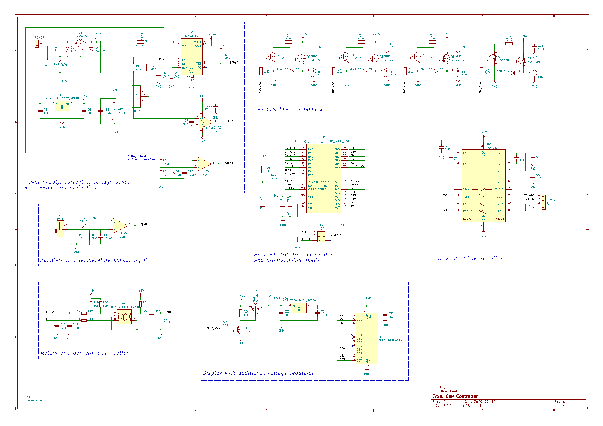
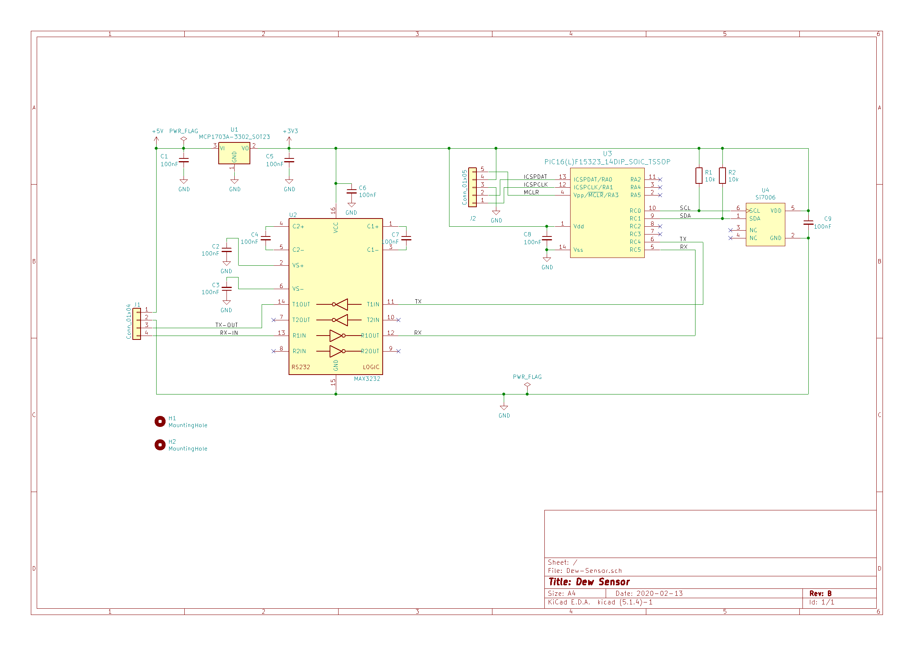

# Dew Controller

Microcontroller based project to control dew heater straps used on a telescope.

## Specification
* Operating voltage: 12V dc
* Power consumption (idle): t.b.d.
* 4 independently controlled heater channels
  * RCA jacks
  * Electronic overcurrent and short circuit protection
  * Total output current: 3.5 A max.
* 12 x 2 OLED display
* External temperature and humidity sensor connected via RS232 interface
  * Uses Silicon Labs Si7006 precision sensor
    * +/-1°C max.
    * +/-5% RH max.
* Auxiliary NTC temperature sensor input for testing and calibration
* User-friendly menu with rotary encoder input

## Theory of operation
The dew controller continuously calculates the required heating power for each connected dew heater strap based upon lens diameter and current temperature and humidity conditions. By carefully controlling the heating power negative seeing effects caused by undesired air movements are reduced to a minimum.
The underlying algorithm compensates for the rate of heat flow from the telescope lens to the cold sky, assuming that the telescope is equipped with a dew shield and only the circular area of the lens is exposed to the sky. An adjustable 'fudge factor' copes with all other deficiencies, like lack of thermal insulation from the heater straps. The theory gives very simular results to the rule of thumb given by [1].

## Hardware
### Controller Unit

The dew controller is build around a PIC16F15356 microcontroller with 16k words of flash memory and 2kB of RAM. It is configured to run at a clock frequency of 4.0 MHz, generated by its internal oscillator. With hindsight, regarding flash memory size and the string constants required by the menu system, the part wasn't the optimal choice. Without compiler optimizations the code doesn't fit on the device. For the next revision of the hardware a pin compatible PIC18F should be considered.

Since the controller has to be capable of measuring the current on each heater channel, the circuit comprises a TI INA180 high side current sense amplifier. To reduce cost and complexity, only a single amplifier is used and firmware measures the current of each channel sequentially. As for overcurrent and short circuit protection, an integrated solution is used. The Vishay SiP32419 is a load switch with programmable current limit up to 3.5A and eliminates the need for a conventional fuse (for which you'll never bring any spares, when you operate the device on a field trip).

The input voltage is measured with a simple voltage divider, buffered by 1/2 LM358. The other half of the Opamp is used for buffering the auxiliary NTC temperature sensor input.

It turned out that the switch mode regulator used on the OLED display module injects a lot of conducted noise back into the supply rails, which seriously impacts the performance of the microcontroller's ADC. The easiest way to block the noise from getting into the microcontroller was using a dedicated linear regulator for the display module. The regulator can be turned off via a MOSFET to save power during standby operation.

The device's menu system is entirely operated by a single rotary encoder with integrated push button. Although the quadrature signals are rudimentary low pass filtered, further debouncing is required in software.

High side P-channel MOSFETs are used to operate the four heater channels. 

The external temperature and humidity sensor is connected via an RS-232 interface, providing flexibility when testing different types of sensors. Although technically, the RS-232 level shifter isn't necessary if short cables are used, it gives good ESD protection and some extra noise immunity.

#### Case design
The housing is designed with [Schaeffer AG Frontplatten Designer](https://www.schaeffer-ag.de/frontplatten-designer)

### Sensor Box
The sensor circuit is very simple. It uses the PIC16F325 with 8k words flash memory and 1kB RAM. Unlike the controller circuit, it is powered by a 3.3V regulator. The Si7006 temperature and humidity sensor via connected I2C. RS-232 level shifting is done by a MAX3232. The PCB is designed to fit into a Hammond 1551 case with custom lid.

## Firmware
Firmware development is done in MPLAB X with XC8 compiler. 

t.b.c.

___
[1]: G. D. Roth, Handbuch für Sternfreunde. Band 1: Technik und Theorie. ISBN 978-3-662-35367-7